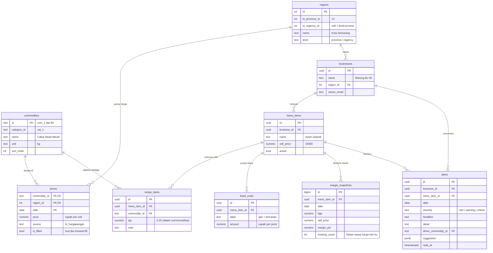

# 02 — Arsitektur

## Diagram sistem

```
   BI Hargapangan API  ·  harian, per kabupaten, tanpa auth
              │
              │  Vercel Cron — 13:30 WIB  (BI publikasi pukul 13:00)
              ▼
      ┌───────────────────┐
      │    Ingestion      │  parse, normalisasi, forward-fill
      │  /api/cron/ingest │  catat ke ingest_runs
      └─────────┬─────────┘
                ▼
          ┌──────────┐
          │  prices  │  time-series (commodity × region × date)
          └────┬─────┘
               │
    ┌──────────┴───────────┐
    ▼                      ▼
┌─────────────────┐  ┌──────────────────┐
│  MARGIN ENGINE  │  │  TREND DETECTOR  │
│  fungsi murni   │  │   Δ7h  ·  Δ30h   │
│  deterministik  │  └────────┬─────────┘
│                 │           │
│ HPP = Σ(takaran │           │
│       × harga)  │           │
│       + biaya   │           │
│         tetap   │           │
│                 │           │
│ margin =        │           │
│  (jual−HPP)     │           │
│   ÷ jual        │           │
└────────┬────────┘           │
         ▼                    │
  margin_snapshots            │
         └──────────┬─────────┘
                    ▼
           ┌──────────────────┐
           │   ALERT AGENT    │  ← satu-satunya AI di jalur keputusan
           │   Claude Haiku   │     pilih ≤3 yang layak diganggu
           └────────┬─────────┘
                    ▼
                 alerts
                    │
                    ▼
           ┌──────────────────┐
           │   Web Dashboard  │
           └────────┬─────────┘
                    ▲
      menu + resep ─┤
                    │
        VLM: foto resep / nota → JSON terstruktur
```

## Tiga keputusan yang harus dibela di Q&A

1. **Margin engine adalah fungsi murni tanpa AI.** Bisa diaudit, bisa diuji, hasilnya sama
   setiap kali. Pemilik warung berhak tahu angkanya dari mana.
2. **AI hanya di dua titik** — memilih apa yang layak diganggu, dan membaca foto. Sisanya rumus.
3. **Satu sumber data, tanpa auth.** Tidak ada yang bisa mati saat final.

---

## Skema database



### Kenapa `fixed_costs` ada

BI hanya melacak 21 komoditas. Warung nyata juga pakai tepung, bumbu, gas, kemasan, dan
tenaga. Tanpa tabel ini, HPP akan terlalu rendah dan seluruh angka margin jadi bohong.

Ini juga jawaban untuk pertanyaan juri *"bagaimana dengan bahan yang tidak ada di data BI?"*

### Kenapa `margin_snapshots` ada

Margin bisa dihitung on-the-fly, tapi snapshot harian memberi:

- riwayat untuk grafik tren 30 hari,
- basis untuk mendeteksi *perubahan* (yang memicu alert),
- bukti bahwa sistem berjalan tiap hari, bukan dihitung saat demo.

### Kenapa `is_filled` ada

BI tidak terbit di akhir pekan dan hari libur. Kita forward-fill agar grafik tidak bolong,
tapi menandainya supaya UI bisa jujur: *"harga Sabtu memakai data Jumat."*

DDL lengkap: [`db/schema.sql`](../db/schema.sql)

---

## Sumber data: BI Hargapangan

**Base:** `https://www.bi.go.id/hargapangan/WebSite/TabelHarga`

| Endpoint | Fungsi |
|---|---|
| `GetRefCommodityAndCategory` | Daftar 10 kategori + 21 varian komoditas |
| `GetGridDataDaerah` | Time-series harga per wilayah |

### Parameter `GetGridDataDaerah`

| Param | Nilai | Catatan |
|---|---|---|
| `price_type_id` | `1` | Pasar tradisional |
| `province_id` | `13` | Jawa Tengah |
| `regency_id` | int | Kosongkan untuk level provinsi |
| `start_date` / `end_date` | `MM/DD/YYYY` | **Lihat jebakan di bawah** |
| `comcat_id` | kosong | Semua komoditas |
| `tipe_laporan` | `1` | |

### ⚠️ Jebakan yang sudah ditemukan

1. **Tanggalnya `MM/DD/YYYY`, bukan `DD/MM/YYYY`.**
   Format salah tidak menghasilkan error — tapi seluruh baris berisi `"-"`.
   Ini akan menghabiskan waktu berjam-jam kalau tidak tahu.

2. **Wajib kirim header `X-Requested-With: XMLHttpRequest`.**

3. **Nilai kosong adalah string `"-"`, bukan `null`.**

4. **Angka memakai pemisah ribuan koma:** `"16,350"` → parse jadi `16350`.

5. **BI publikasi pukul 13:00 WIB, hari kerja saja.** Jalankan cron 13:30.
   Akhir pekan dan libur nasional tidak ada data baru.

6. **Mapping `province_id`/`regency_id` ke nama wilayah tidak terdokumentasi.**
   Harus dipetakan manual sekali (lihat tugas Orang 1).

### Contoh panggilan terverifikasi

```bash
curl -s 'https://www.bi.go.id/hargapangan/WebSite/TabelHarga/GetGridDataDaerah?price_type_id=1&comcat_id=&province_id=13&regency_id=&market_id=&tipe_laporan=1&start_date=09/08/2026&end_date=09/11/2026' \
  -H 'X-Requested-With: XMLHttpRequest'
```

Respons (dipersingkat):

```json
{ "data": [
  { "no": "I", "name": "Beras", "level": 1,
    "09/08/2026": "16,350", "09/09/2026": "16,350", "09/11/2026": "-" }
]}
```

---

## Margin engine

Inti produk. **Wajib fungsi murni** — tanpa I/O, tanpa panggilan database, tanpa AI.
Ini yang membuatnya bisa diuji, bisa diaudit, dan bisa dimodifikasi di depan juri.

```ts
// lib/margin.ts

export type Ingredient  = { commodityId: string; qty: number }
export type FixedCost   = { label: string; amount: number }
export type PriceLookup = (commodityId: string) => number | null

export type HppResult = {
  hpp: number
  fromData: number      // jumlah bahan yang harganya dari BI
  missing: string[]     // commodityId tanpa harga hari itu
}

export function computeHpp(
  ingredients: Ingredient[],
  fixedCosts: FixedCost[],
  priceOf: PriceLookup,
): HppResult {
  let hpp = 0
  let fromData = 0
  const missing: string[] = []

  for (const ing of ingredients) {
    const price = priceOf(ing.commodityId)
    if (price === null) { missing.push(ing.commodityId); continue }
    hpp += price * ing.qty
    fromData++
  }
  for (const fc of fixedCosts) hpp += fc.amount

  return { hpp, fromData, missing }
}

export function computeMargin(sellPrice: number, hpp: number): number {
  if (sellPrice <= 0) return 0
  return ((sellPrice - hpp) / sellPrice) * 100
}
```

### Konfigurasi ambang — target live coding

Simpan sebagai objek, **bukan if-else tersebar**. Juri minta ubah ambang → satu baris.

```ts
// lib/thresholds.ts
export const SEVERITY = {
  critical: { marginBelow: 10, dropPct: 15 },
  warning:  { marginBelow: 20, dropPct: 8  },
  info:     { marginBelow: 30, dropPct: 5  },
} as const
```

Latih skenario ini sampai 30 detik:

> *"Tambahkan tingkat `urgent` di bawah 5%."* → tambah satu baris, UI berubah.

---

## Kontrak API

| Route | Method | Fungsi |
|---|---|---|
| `/api/cron/ingest` | POST | Tarik harga hari ini. Dipanggil Vercel Cron. |
| `/api/cron/recompute` | POST | Hitung ulang snapshot + generate alert. |
| `/api/businesses` | POST | Daftarkan warung |
| `/api/menu` | GET, POST | Daftar / tambah menu |
| `/api/menu/[id]` | GET, PATCH, DELETE | Detail menu + resep |
| `/api/menu/[id]/margin` | GET | Margin hari ini + riwayat 30 hari |
| `/api/alerts` | GET | Alert aktif untuk satu warung |
| `/api/alerts/[id]/read` | POST | Tandai sudah dibaca |
| `/api/ai/parse-recipe` | POST | Upload foto → JSON resep terstruktur |
| `/api/ai/suggest` | POST | Saran substitusi untuk satu menu |

### Contoh respons `/api/menu/[id]/margin`

```json
{
  "menuItem": { "id": "...", "name": "Ayam Geprek", "sellPrice": 15000 },
  "today": {
    "date": "2026-09-11",
    "hpp": 13350,
    "marginPct": 11.0,
    "fromData": 4,
    "manualCosts": 2,
    "missing": []
  },
  "history": [
    { "date": "2026-09-02", "marginPct": 31.2 },
    { "date": "2026-09-11", "marginPct": 11.0 }
  ],
  "driver": {
    "commodityId": "com_18",
    "name": "Cabai Rawit Merah",
    "changePct": 58.3,
    "windowDays": 9
  }
}
```

---

## Prompt AI

### Alert agent

Input: daftar menu dengan margin hari ini, margin 7 hari lalu, dan komoditas pendorong.
Output: maksimal 3 alert, terurut kepentingan.

Aturan yang harus masuk prompt:

- Jangan laporkan menu yang marginnya stabil, walau rendah — pemilik sudah tahu.
- Prioritaskan **perubahan**, bukan level absolut.
- Satu kalimat headline, bahasa Indonesia sehari-hari, tanpa jargon.
- Selalu sebut komoditas penyebabnya.

Gunakan **structured outputs** (`output_config.format`) agar JSON dijamin sesuai skema.

### VLM parse resep

Input: foto resep tulis tangan atau nota belanja.
Output: `{ items: [{ nameRaw, qty, unit, matchedCommodityId | null }] }`

Pencocokan ke 21 komoditas BI dilakukan di sisi kode, bukan diserahkan ke model —
model hanya membaca teks dan angka. Yang tidak cocok masuk ke `fixed_costs`
untuk diisi harganya manual.

**Dokumentasikan sambil jalan:** prompt utama, halusinasi yang ditemukan, re-prompting,
dan bagian yang diperbaiki manual. Rubrik EXASTI memintanya secara eksplisit.
