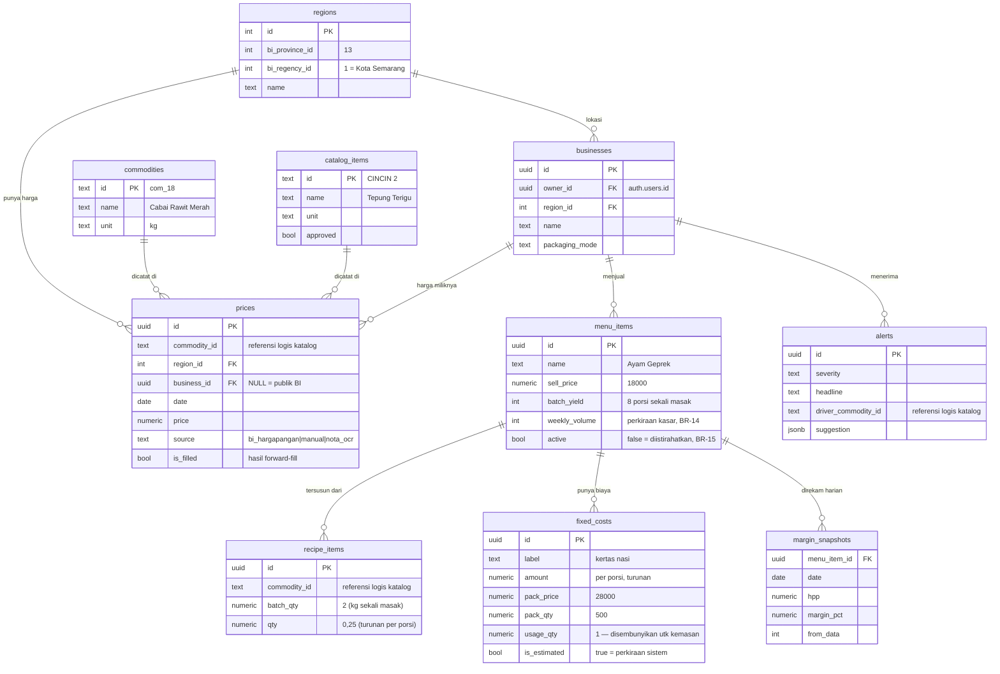

# 02 — Arsitektur

## Diagram sistem

```
   BI Hargapangan API  ·  harian, per kabupaten, tanpa auth
              │
              │  Vercel Cron — 13:30 WIB  (BI publikasi pukul 13:00)
              ▼
      ┌───────────────────┐
      │    Ingestion      │  parse, normalisasi, forward-fill
      │  /api/cron/ingest │  catat ke ingest_runs
      └─────────┬─────────┘
                ▼
          ┌──────────┐        harga milik warung sendiri
          │  prices  │ ◀───── (business_id terisi, source='manual'|'nota_ocr')
          └────┬─────┘
               │   satu tabel untuk SEMUA harga
    ┌──────────┴───────────┐
    ▼                      ▼
┌─────────────────┐  ┌──────────────────┐
│  MARGIN ENGINE  │  │  TREND DETECTOR  │
│  fungsi murni   │  │   Δ7h  ·  Δ30h   │
│  deterministik  │  └────────┬─────────┘
│                 │           │
│ HPP = Σ(takaran │           │
│       × harga)  │           │
│       + biaya   │           │
│         tetap   │           │
└────────┬────────┘           │
         ▼                    │
  margin_snapshots            │
         └──────────┬─────────┘
                    ▼
           ┌──────────────────┐
           │  PEMILIH ALERT   │  Cincin 0: aturan (3 penurunan terbesar)
           │                  │  Cincin 2: AI agent
           └────────┬─────────┘
                    ▼
                 alerts
                    │
                    ▼
           ┌──────────────────┐
           │  PRIORITAS       │  BR-14: untung × weekly_volume
           │  & PENGELOMPOKAN │  BR-15: sehat / tipis / rugi
           └────────┬─────────┘
                    ▼
           ┌──────────────────┐
           │   Web Dashboard  │◀── menu planner · simulator ·
           │                  │    peta eksposur   (Cincin 1)
           └────────┬─────────┘
                    ▲
      menu + resep ─┤  (input BATCH: "2 kg → 8 porsi")
                    │
         📷 foto nota / resep
                    │
           ┌────────┴─────────┐
           │   lib/ai/client  │──▶ ai_cache  ← WAJIB, lihat §Ketahanan
           │  (Gemini Flash)  │
           └──────────────────┘
```

## Empat keputusan yang harus dibela di Q&A

1. **Margin engine fungsi murni tanpa AI.** Bisa diaudit, bisa diuji, hasilnya
   sama setiap kali. Pemilik warung berhak tahu dari mana angkanya.
2. **Satu tabel harga untuk semua sumber.** Barang yang dicatat pemilik
   diperlakukan persis seperti data resmi, jadi tidak ada bagian biaya yang
   luput dari analisis BR-04.
3. **AI hanya di lapisan input dan penyaringan**, dan selalu dikonfirmasi manusia.
4. **Demo tidak bergantung pada panggilan API live.** Semua hasil AI di-cache.

---

## Skema database

DDL Supabase lengkap dan tervalidasi:
[`db/supabase/01_migration.sql`](../db/supabase/01_migration.sql).
`db/schema.sql` adalah rancangan PostgreSQL awal tanpa Auth/RLS dan bukan sumber
kebenaran untuk deployment Supabase.



`prices` memakai UUID sebagai primary key untuk Data API. Keunikan bisnisnya
tetap dijaga oleh dua partial unique index: satu untuk harga BI
(`business_id IS NULL`) dan satu untuk harga warung. `commodity_id` adalah
referensi logis ke `commodities` atau `catalog_items`; PostgreSQL tidak dapat
menyatakan satu foreign key ke dua tabel berbeda.

Semua 12 tabel `public` memakai RLS. View memakai `security_invoker=true`, dan
grant `anon`/`authenticated` diberikan dengan pola revoke-then-grant agar default
privilege project tidak memperluas akses. Suite
[`db/supabase/05_verify.sql`](../db/supabase/05_verify.sql) menguji struktur,
constraint, least privilege, formula harga efektif, serta isolasi dua warung.

### Kenapa `batch_qty` dan `qty` dua-duanya disimpan

Pemilik warung berpikir **"2 kg ayam jadi 8 porsi"**, bukan "0,25 kg per porsi".
Memaksa dia membagi sendiri adalah penyebab utama onboarding gagal
(lihat [07-UX.md §8](07-UX.md#8-kenapa-desainnya-begini--dua-simulasi)).

Jadi `batch_qty` menyimpan angka aslinya, `qty` adalah turunan yang dipakai
engine. Saat pemilik mengedit, yang ditampilkan kembali adalah angkanya sendiri.

### Kenapa `business_id` ada di `prices`

Barang di luar 21 komoditas BI (saus, tepung, gas) harganya dicatat pemilik
sendiri. Kalau disimpan di tabel terpisah tanpa riwayat, harga saus naik →
untung turun → **sistem tidak bisa menjelaskan kenapa**, dan alert jadi
menyesatkan.

Dengan satu tabel: BR-04 berlaku seragam, riwayat gratis, dan engine tetap satu
jalur lookup.

### Kenapa `is_estimated` ada di `fixed_costs`

Gas dan kemasan tidak ditanyakan saat menu pertama — sistem memberi perkiraan
Rp 1.200 dan menandainya. Antarmuka wajib menampilkan tanda itu.

### Kenapa `ai_cache` ada

Demo tidak boleh bergantung panggilan live. Lihat §Ketahanan.

---

## Sumber data: BI Hargapangan

**Base:** `https://www.bi.go.id/hargapangan/WebSite/TabelHarga`

| Endpoint | Fungsi |
|---|---|
| `GetRefCommodityAndCategory` | 10 kategori + 21 varian komoditas |
| `GetGridDataDaerah` | Time-series harga per wilayah |

### Parameter `GetGridDataDaerah`

| Param | Nilai | Catatan |
|---|---|---|
| `price_type_id` | `1` | Pasar tradisional |
| `province_id` | `13` | Jawa Tengah |
| `regency_id` | int | Kosongkan untuk level provinsi |
| `start_date` / `end_date` | `MM/DD/YYYY` | **lihat jebakan** |
| `comcat_id` | kosong | Semua komoditas |
| `tipe_laporan` | `1` | |

### ⚠️ Jebakan yang sudah ditemukan dan diverifikasi

1. **Tanggal request `MM/DD/YYYY`, tapi kunci tanggal di RESPONS `DD/MM/YYYY`.**
   Format **berbeda** di satu API yang sama — sudah dikonfirmasi berjalan di
   `scripts/skeleton.py`. Format request yang salah **tidak menghasilkan error**,
   seluruh baris hanya berisi `"-"`.
2. **Wajib header `X-Requested-With: XMLHttpRequest`.**
3. **Nilai kosong adalah string `"-"`, bukan `null`.**
4. **Angka memakai pemisah ribuan koma:** `"16,350"` → `16350`.
5. **BI publikasi 13:00 WIB, hari kerja saja.** Jalankan cron 13:30.
6. **Mapping `province_id`/`regency_id` ke nama wilayah tidak terdokumentasi.**
   Harus dipetakan manual sekali. `province_id=13`, `regency_id=1` = Kota Semarang
   (terverifikasi).
7. **Nama komoditas punya spasi di belakang** — mis. `"Cabai Merah Keriting "`.
   Selalu `.strip()`. Nama aslinya juga berbeda dari dugaan: `Daging Ayam Ras Segar`,
   `Cabai Rawit Hijau`, `Beras Kualitas Medium I`.
8. **Respons memuat 28 baris, bukan 21** — baris kategori induk ikut terkirim
   bersama variannya. Jangan dihitung dua kali.
9. **Rentang > 120 hari sering timeout.** Pecah per 90 hari lalu gabungkan
   (lihat `scripts/cari_demo_window.py`).

### Contoh panggilan terverifikasi

```bash
curl -s 'https://www.bi.go.id/hargapangan/WebSite/TabelHarga/GetGridDataDaerah?price_type_id=1&comcat_id=&province_id=13&regency_id=&market_id=&tipe_laporan=1&start_date=09/08/2026&end_date=09/11/2026' \
  -H 'X-Requested-With: XMLHttpRequest'
```

```json
{ "data": [
  { "no": "I", "name": "Beras", "level": 1,
    "09/08/2026": "16,350", "09/09/2026": "16,350", "09/11/2026": "-" }
]}
```

### Sumber lain yang sudah dicek — jangan dipakai

| Sumber | Status | Catatan |
|---|---|---|
| SiHati Jawa Tengah (`hargajateng.org`) | ❌ **HTTP 502** | Padanan Jateng, tapi mati di semua variasi URL |
| SP2KP / SISP Kemendag | ⚠️ SPA | Situs hidup, tapi tidak ada API — semua path balik shell 137 KB |
| Bapanas Panel Harga | ⚠️ 401 | API terkunci token, belum ditemukan |
| Siskaperbapo | ⚠️ Jawa Timur | Komoditas jauh lebih luas, tapi **salah provinsi** |
| Portal open data daerah | ❌ 404/502 | Semua mati |

**Kesimpulan: satu sumber eksternal terverifikasi — BI.** Sisanya lapisan data
yang dibangun pengguna sendiri. Jangan pernah bilang "kami pakai banyak sumber".

Kolom `prices.source` sudah menyiapkan penambahan sumber nanti tanpa perubahan
skema.

---

## Margin engine

Inti produk. **Wajib fungsi murni** — tanpa I/O, tanpa database, tanpa AI.

```ts
// lib/margin.ts

export type Ingredient  = { commodityId: string; qty: number }   // per porsi
export type FixedCost   = { label: string; amount: number }
export type PriceLookup = (commodityId: string) => number | null

export type HppResult = {
  hpp: number
  fromData: number      // bahan yang harganya ada
  missing: string[]     // bahan tanpa harga hari itu
}

export function computeHpp(
  ingredients: Ingredient[],
  fixedCosts: FixedCost[],
  priceOf: PriceLookup,
): HppResult {
  let hpp = 0
  let fromData = 0
  const missing: string[] = []

  for (const ing of ingredients) {
    const price = priceOf(ing.commodityId)
    if (price === null) { missing.push(ing.commodityId); continue }
    hpp += price * ing.qty
    fromData++
  }
  for (const fc of fixedCosts) hpp += fc.amount

  return { hpp, fromData, missing }
}

export function computeMargin(sellPrice: number, hpp: number): number {
  if (sellPrice <= 0) return 0
  return ((sellPrice - hpp) / sellPrice) * 100
}
```

### Konversi batch → per porsi

Terjadi **sekali saat menyimpan**, bukan di engine:

```ts
// lib/recipe.ts
export const perPorsi = (batchQty: number, batchYield: number) =>
  batchQty / batchYield
```

### Harga efektif — BR-09

Harga BI adalah rata-rata sekabupaten, bukan harga langganan warung. Gabungkan
**level pemilik** dengan **gerakan pasar**:

```ts
// lib/price.ts
export function hargaEfektif(
  komoditasId: string,
  hari: Date,
  biSeries: Map<string, Map<string, number>>,
  hargaSendiri?: { harga: number; tanggal: Date },
): { harga: number | null; alasan: string } {
  const bi = biSeries.get(komoditasId)

  // di luar 21 komoditas BI — tidak ada gerakan yang bisa dipakai
  if (!bi) return hargaSendiri
    ? { harga: hargaSendiri.harga, alasan: "harga kamu (beku)" }
    : { harga: null, alasan: "tidak ada harga" }

  const biKini = priceOn(bi, hari)
  if (!hargaSendiri) return { harga: biKini, alasan: "harga pasar (BI)" }

  const biSaatBeli = priceOn(bi, hargaSendiri.tanggal)
  if (!biKini || !biSaatBeli) return { harga: hargaSendiri.harga, alasan: "harga kamu (beku)" }

  const rasio = biKini / biSaatBeli
  if (rasio < 0.3 || rasio > 3.0)          // pagar pengaman
    return { harga: biKini, alasan: "harga pasar (rasio tidak wajar)" }

  return { harga: hargaSendiri.harga * rasio,
           alasan: `harga kamu × gerakan pasar ${((rasio - 1) * 100).toFixed(0)}%` }
}
```

**Jangan implementasikan sebagai "harga pemilik selalu menang".** Itu membekukan
harga di nilai lama dan membuat sistem buta terhadap kenaikan pasar — produk mati
diam-diam tanpa error. Penjelasan lengkap: [BR-09](06-SRS.md#br-09--harga-efektif-).

Referensi berjalan: `scripts/skeleton.py` → `harga_efektif()`.

### Simulator "kalau harga jadi segini" *(Cincin 1)*

Karena engine fungsi murni, simulator **hampir gratis** — panggil ulang dengan
`priceOf` yang disubstitusi:

```ts
const simulated = (override: Record<string, number>): PriceLookup =>
  (id) => override[id] ?? realPriceOf(id)

computeHpp(ingredients, fixedCosts, simulated({ com_ayam: 60000 }))
```

Sekitar dua jam kerja, dan jadi momen terkuat di demo. Ini juga bukti
arsitekturnya benar — sebutkan saat Q&A.

### Konfigurasi ambang — target live coding

Simpan sebagai objek tunggal, **bukan if-else tersebar**:

```ts
// lib/thresholds.ts
export const SEVERITY = {
  critical: { marginBelow: 10, dropPct: 15 },
  warning:  { marginBelow: 20, dropPct: 8  },
  info:     { marginBelow: 30, dropPct: 5  },
} as const
```

Latih skenario ini sampai 30 detik: *"Tambahkan tingkat `urgent` di bawah 5%."*

---

## Modul pendukung

Tiga hal kecil yang kalau tidak ada akan menghancurkan onboarding.

### `lib/commodities.ts` — nama tampilan ≠ nama BI

```ts
// Bu Sri bilang "ayam", bukan "Daging Ayam Ras Segar".
export const TAMPIL: Record<string, string> = {
  "Daging Ayam Ras Segar":      "Ayam",
  "Beras Kualitas Medium I":    "Beras",
  "Cabai Rawit Hijau":          "Cabai rawit",
  "Cabai Merah Keriting":       "Cabai merah",   // ⚠ nama BI punya spasi di belakang
  "Bawang Merah Ukuran Sedang": "Bawang merah",
  "Minyak Goreng Curah":        "Minyak goreng",
  "Telur Ayam Ras Segar":       "Telur",
  // …
}

// Pencarian harus menerima KEDUANYA plus salah ketik lokal:
export const ALIAS: Record<string, string> = {
  cabe: "Cabai Rawit Hijau", telor: "Telur Ayam Ras Segar",
  brambang: "Bawang Merah Ukuran Sedang", mgrg: "Minyak Goreng Curah",
}
```

### `lib/units.ts` — satuan yang dia pakai

```ts
export const KE_KG: Record<string, number> = {
  kg: 1, gram: 0.001, ons: 0.1,        // aman
  liter_minyak: 0.9,
  liter_beras: 0.8,                     // ⚠ tergantung jenis
  butir_telur: 0.06,                    // ⚠ bervariasi
  ekor_ayam: 1.2,                       // 🔴 SANGAT bervariasi
}

// Satuan berisiko WAJIB menampilkan asumsinya, jangan konversi diam-diam:
//   "1 ekor ≈ 1,2 kg → total 2,4 kg   [betulkan]"
export const BERISIKO = new Set(["liter_beras", "butir_telur", "ekor_ayam"])
```

### `lib/packaging.ts` — kalkulator pack

```ts
// Pemilik tahu "1 pack 500 lembar Rp 28.000". Dia TIDAK tahu "Rp 56/porsi".
export const perPorsi = (packPrice: number, packQty: number, usageQty = 1) =>
  (packPrice / packQty) * usageQty

// usageQty untuk kemasan hampir selalu 1 → kolomnya DISEMBUNYIKAN di UI (FR-44).
// Untuk saus/bumbu, usageQty harus ditanya (15 g dari botol 340 g).
```

### Pagar pengaman salah satuan — FR-57

```ts
// Ketik 2000 maksudnya gram tapi satuannya masih kg → modal 1000× lipat.
export function cekWajar(biayaBahanPerPorsi: number, hargaJual: number) {
  if (biayaBahanPerPorsi > hargaJual)
    throw new SalahSatuan(biayaBahanPerPorsi, hargaJual)  // tolak simpan, tanya dulu
}
```

---

## Prioritas dan pengelompokan

### BR-14 — pembobotan volume

```ts
// lib/priority.ts
export const dampakMingguan = (untungPerPorsi: number, weeklyVolume: number | null) =>
  weeklyVolume == null ? null : untungPerPorsi * weeklyVolume

// Urutan dashboard:
//   weekly_volume ADA    → urut dampak rupiah menaik   (paling menggerus di atas)
//   weekly_volume KOSONG → urut margin % menaik        (perilaku Cincin 0)
```

**Jangan mengurutkan berdasarkan persentase kalau volume tersedia.** Menu margin
7% yang laku 150/minggu menggerus Rp 189.000; menu margin −3% yang laku 5 hanya
Rp 1.700. Mengurutkan berdasarkan persen membuat pemilik memperbaiki yang salah.

Ini **pembobotan yang sama dengan BR-04**, satu lapis di atasnya.

### BR-15 — pengelompokan kesehatan

```ts
export const KESEHATAN = { sehat: 20, tipis: 0 } as const   // ambang margin %

export const kelompok = (marginPct: number) =>
  marginPct >= KESEHATAN.sehat ? "sehat"
  : marginPct >= KESEHATAN.tipis ? "tipis"
  : "rugi"
```

**Menu yang `active = false` tetap masuk recompute harian** — supaya sistem bisa
memanggil balik: *"Telur Balado sudah untung lagi. Jual lagi?"* (FR-53).

Yang **tidak boleh**: menyarankan menu mana yang dipromosikan. Itu butuh data
penjualan yang tidak dimiliki (C-4).

---

## Batas modal per porsi — BR-13

Pembatasnya: **apakah biaya itu ikut jumlah porsi.**

```
MASUK ke HPP                        TIDAK MASUK
bahan pangan                        sewa tempat
kemasan, sendok, plastik            listrik langganan
gas, air masak                      gaji karyawan
bumbu & bahan kecil
```

Yang tidak masuk nilainya bergantung berapa porsi terjual, dan sistem tidak tahu
itu (C-4). Memasukkannya berarti mengarang.

**Konsekuensi untuk API dan UI:** setiap respons yang memuat angka untung harus
membawa penanda agar antarmuka menampilkan *"belum dikurangi sewa dan listrik
bulanan"* (FR-48).

---

## Ketahanan — demo tidak boleh bergantung API live

Rate limit, jaringan panitia, kuota habis — semuanya terjadi tepat saat
presentasi. Tiga lapis pertahanan:

**Lapis 1 — AI gagal, perhitungan tetap jalan.** (FR-31)
Cabut API key → aplikasi hidup, hanya fitur AI menampilkan pesan.

**Lapis 2 — semua hasil AI di-cache** ke tabel `ai_cache`.
Saat demo, yang tampil adalah data tersimpan. Panggilan live kalau berhasil
adalah bonus, bukan syarat. **Bangun cache sejak awal, jangan ditambahkan
belakangan.**

**Lapis 3 — video cadangan.** Rekam fitur AI yang berhasil, simpan offline.

> **Hari 6: latihan demo dengan mode pesawat menyala.** Ini yang paling sering
> dilewatkan tim, dan paling sering menjatuhkan mereka.

---

## Penyedia AI

**Google AI Studio — Gemini Flash.** Sudah divalidasi pada **nota Indonesia asli**
(dataset CORD, `scripts/test_ocr_nyata.py`):

```
35 nota · 81 barang
  nama barang   79/81   98%
  harga         73/81   90%
  harga ditebak     0           ← syarat mutlak, terpenuhi
  latensi       6 s tunggal, 14–20 s di bawah beban
```

⚠️ **Belum terbukti: nota tulisan tangan.** CORD mayoritas nota tercetak. Warung
belanja di toko kelontong dan pasar. Bagian itu masih harus diuji sendiri —
jangan klaim OCR "bekerja" sampai sudah.

⚠️ **Wajib pakai rantai fallback model.** Terbukti saat pengujian: alias
`gemini-flash-latest` kena **503 (sibuk)**, dan `gemini-2.5-flash` kena **404
(sudah pensiun untuk pengguna baru)**. Rantai yang berhasil:

```
gemini-3.6-flash → gemini-3.5-flash → gemini-3.8-flash → gemini-flash-lite-latest
```

Perlakukan **404, 503, dan 429 sama** — semuanya lanjut ke model berikutnya.

### Batas terukur (`scripts/test_ratelimit.py`, 11 Sep 2026)

```
7 permintaan berhasil beruntun, lalu 429 mulai permintaan ke-7
pulih penuh setelah 60 detik
latensi 4,0 s rata-rata  ·  5,1 s maksimum  ·  13 s pada panggilan pertama setelah pulih
```

**Lebih ketat dari dokumentasi Google** (yang menyebut 15/menit). Konsekuensi desain:

| Temuan | Konsekuensi |
|---|---|
| Latensi 4 detik | UI **wajib** menampilkan indikator tunggu (NFR-22) |
| Batas ~7 per burst | Proses nota **satu per satu**, jangan beruntun. Pakai antrean. |
| Pulih 60 detik | Retry dengan jeda, bukan langsung |

**Rotasi kunci tidak dibangun.** Pemakaian nyata adalah satu nota per unggahan —
tidak akan mendekati batas. Menumpuk kunci free tier untuk melipatgandakan kuota
juga bukan sesuatu yang mau dijelaskan ke juri. Yang sah: satu kunci per anggota
tim untuk pekerjaan masing-masing.

Alasannya cocok dengan tiga syarat tim:

```
gratis, tanpa kartu kredit   ✓  ambil key di aistudio.google.com, 2 menit
vision                       ✓  pemakaian utama: OCR nota & resep
structured output            ✓  skema JSON dijamin
~1.000 request/hari          ✓  demo butuh puluhan
setup                        ✓  satu env var, tanpa CLI, tanpa billing
```

**Peringatan privasi:** di free tier, data boleh dipakai Google untuk melatih
produknya. Untuk demo dengan data buatan sendiri, aman. **Jangan unggah nota
warung sungguhan tanpa memberi tahu pemiliknya, dan jangan klaim "data pengguna
aman" di pitch.**

Alternatif berbayar kalau nanti butuh kualitas vision lebih tinggi: Claude Haiku
4.5 (~$1/$5 per MTok, seluruh lomba di bawah $5) — tapi perlu kartu kredit.

### Satu file pembungkus

```
lib/ai/client.ts   ← seluruh panggilan provider lewat sini
```

Ganti provider = ubah satu file. Juga menang di live coding kalau juri bertanya
*"bisa ganti model?"*

---

## Kontrak API

| Route | Method | Fungsi | Cincin |
|---|---|---|---|
| `/api/cron/ingest` | POST | Tarik harga hari ini | 0 |
| `/api/cron/recompute` | POST | Snapshot + alert | 0 |
| `/api/businesses` | POST | Daftarkan warung | 0 |
| `/api/menu` | GET, POST | Daftar / tambah menu | 0 |
| `/api/menu/[id]` | GET, PATCH, DELETE | Detail + resep | 0 |
| `/api/menu/[id]/margin` | GET | Untung hari ini + riwayat 30 hari | 0 |
| `/api/alerts` | GET | Alert aktif | 0 |
| `/api/alerts/[id]/read` | POST | Tandai dibaca | 0 |
| `/api/menu/[id]/active` | POST | Istirahatkan / jual lagi | 1 |
| `/api/menu/volume` | POST | Simpan perkiraan volume mingguan | 1 |
| `/api/business/packaging` | POST | makan di tempat / bungkus / campur | 1 |
| `/api/planner` | GET | Menu dikelompokkan sehat/tipis/rugi | 1 |
| `/api/exposure` | GET | Peta eksposur menu × bahan | 1 |
| `/api/simulate` | POST | What-if harga | 1 |
| `/api/ai/parse-nota` | POST | Foto nota → item + harga | 1 |
| `/api/ai/parse-recipe` | POST | Foto resep → bahan + takaran | 2 |
| `/api/ai/suggest` | POST | Saran substitusi | 2 |

### Contoh respons `/api/menu/[id]/margin`

```json
{
  "menuItem": { "id": "...", "name": "Ayam Geprek",
                "sellPrice": 18000, "batchYield": 8 },
  "today": {
    "date": "2026-09-11",
    "hpp": 16740,
    "profitPerPorsi": 1260,
    "marginPct": 7.0,
    "fromData": 5,
    "estimatedCosts": 1,
    "missing": []
  },
  "history": [
    { "date": "2026-09-03", "marginPct": 17.1, "profitPerPorsi": 3085 },
    { "date": "2026-09-11", "marginPct": 7.0,  "profitPerPorsi": 1260 }
  ],
  "driver": {
    "commodityId": "com_ayam",
    "name": "Daging Ayam Ras",
    "changePct": 20.0,
    "contributionRp": 1825,
    "sharePct": 61,
    "windowDays": 7
  },
  "notDriver": {
    "name": "Cabai Rawit Merah",
    "changePct": 58.2,
    "sharePct": 9
  },
  "suggestion": { "type": "reprice", "value": 20000 }
}
```

Perhatikan `notDriver` — antarmuka **wajib** menampilkan kontras ini. Tanpa
kalimat kedua, produk ini cuma aplikasi harga pangan biasa.

### Contoh respons `/api/planner` *(Cincin 1)*

```json
{
  "date": "2026-09-12",
  "hasVolume": true,
  "groups": {
    "sehat": [
      { "id": "…", "name": "Nasi Goreng", "profitPerPorsi": 3600,
        "marginPct": 24.0, "weeklyVolume": 80, "weeklyImpact": 288000 }
    ],
    "tipis": [
      { "id": "…", "name": "Ayam Geprek", "profitPerPorsi": 1260,
        "marginPct": 7.0, "weeklyVolume": 150, "weeklyImpact": 189000,
        "suggestion": { "type": "reprice", "value": 20000 } }
    ],
    "rugi": [
      { "id": "…", "name": "Telur Balado", "profitPerPorsi": -340,
        "marginPct": -3.0, "weeklyVolume": 5, "weeklyImpact": -1700 }
    ]
  },
  "resting": [
    { "id": "…", "name": "Rendang", "marginPct": 22.0,
      "readyToResume": true }
  ],
  "netProfitDisclaimer": true
}
```

`weeklyImpact` yang menentukan urutan di dalam tiap kelompok, bukan `marginPct`.
`readyToResume` memicu notifikasi FR-53. `netProfitDisclaimer` memaksa UI
menampilkan catatan BR-13.

---

## Prompt AI

### OCR nota belanja *(Cincin 1)*

Input: foto nota. Output: `{ items: [{ nameRaw, qty, unit, totalPrice }] }`.
Pencocokan ke komoditas/katalog dilakukan **di kode**, bukan model (FR-28).
Hasil selalu ditampilkan untuk dikonfirmasi pemilik sebelum disimpan.

### Pencocokan nama bahan

| Sasaran | Cara | Alasan |
|---|---|---|
| 21 komoditas BI | pencocokan string di kode | kecil, tetap, deterministik |
| Katalog barang warung | AI + konfirmasi pemilik | besar, tumbuh, banyak nama lokal |
| Naik jadi item katalog baru | ambang kemunculan (≥3 warung) | melindungi data bersama |

### Pemilih alert

**Cincin 0 — aturan, bukan AI:** ambil 3 penurunan margin terbesar yang melewati
ambang BR-05, buang yang perubahannya < 2 poin.

**Cincin 2 — AI:** prioritaskan *perubahan* bukan level absolut; satu kalimat
headline bahasa sehari-hari; selalu sebut komoditas penyebab; pakai structured
outputs.

**Dokumentasikan sambil jalan** di `docs/AI-PROCESS.md`: prompt utama, halusinasi
yang ditemukan, re-prompting, bagian yang diperbaiki manual. Rubrik memintanya
eksplisit, dan rekonstruksi di akhir akan terlihat karangan.
